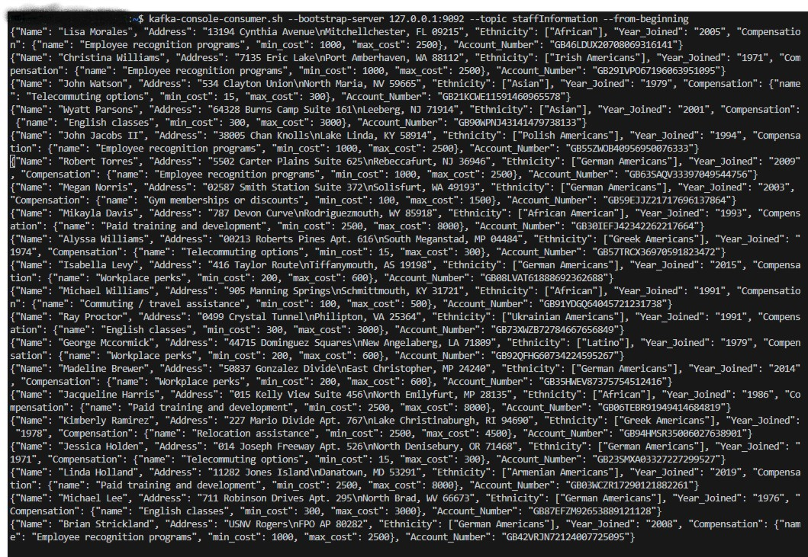
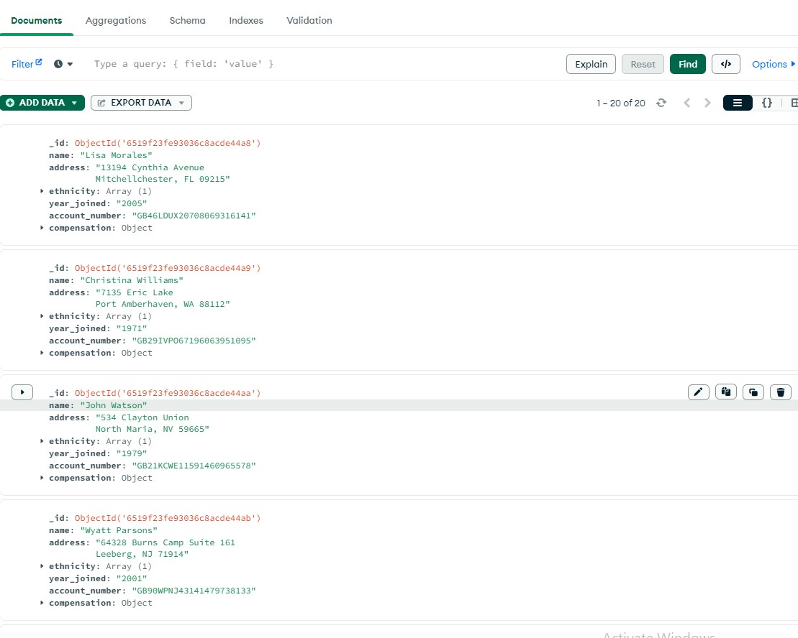

#Staff Information System using Kafka, Python and MongoDB
This repository contain the coding files of a simple staff information system developed with Kafka-Python and MongoDB.

The staff information were generated using [Faker](https://faker.readthedocs.io/en/master/index.html), a python package for generating fake data. This allows me to simulate a real-world employees data and the data covered are:
1. Name
2. Address
3. Ethnicity
4. Compensation 
5. Account Number

No. 3 and 4 was inspired by [Sevdimali's article ](https://medium.datadriveninvestor.com/custom-provider-for-faker-in-python-238490d4640c) on Faker.

A Kafka-Producer produces these above information, a Consumer consumes it and ingest it to a MongoDB collection.

## Installation
1. Clone the repository: `git clone https://github.com/classicalmuheeb/Kafka_Python_MongoDB`
2. Navigate to the project directory. 
3. Install dependencies: `pip install -r requirements.txt`

## Usage
To run the application, follow the following steps:
1. Start Zookeeper and Kafka   
2. Execute the following command:
```bash
python main.py



